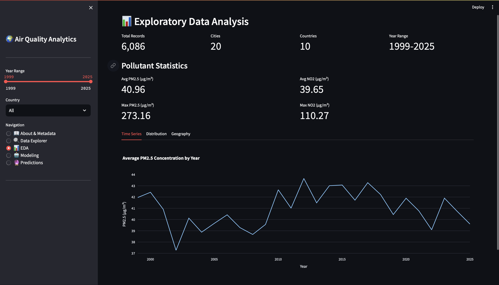
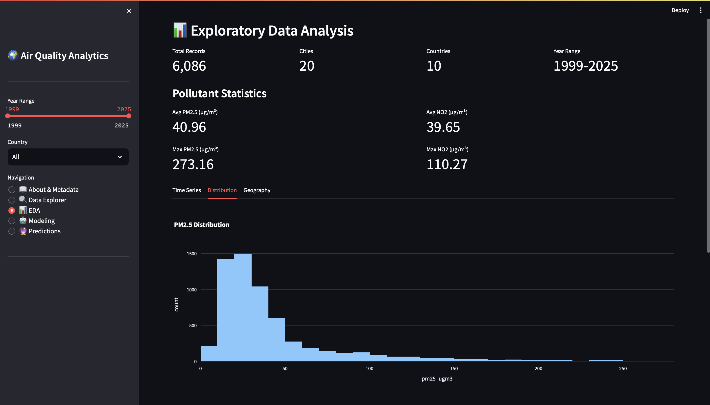
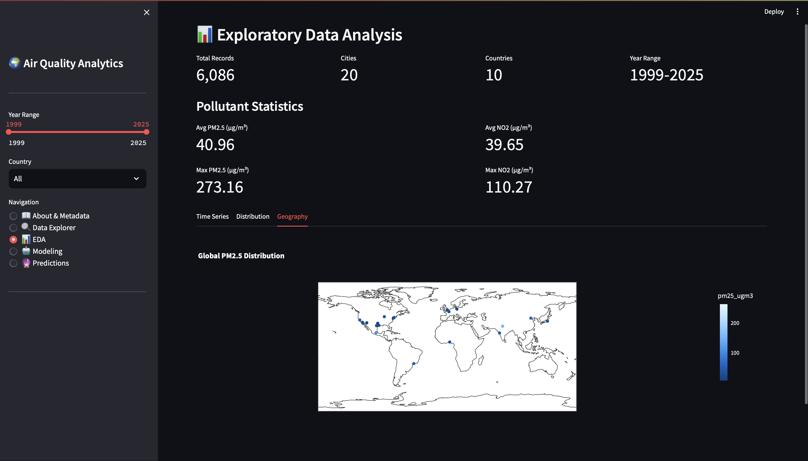
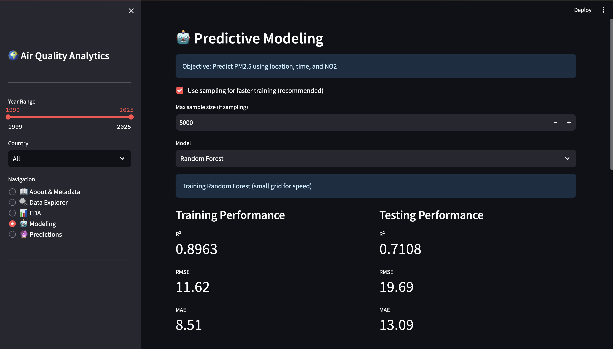
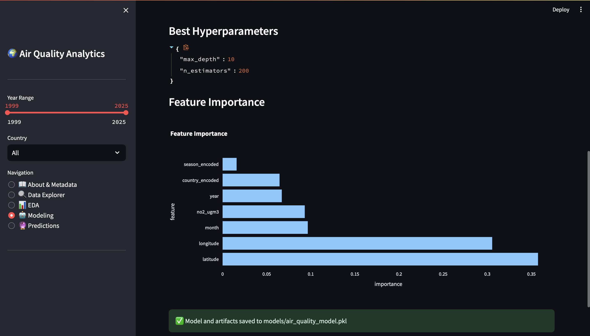
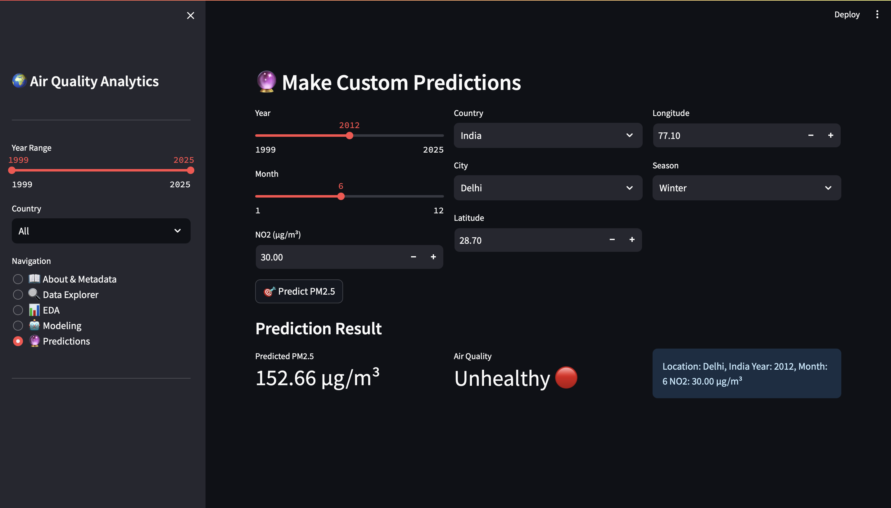
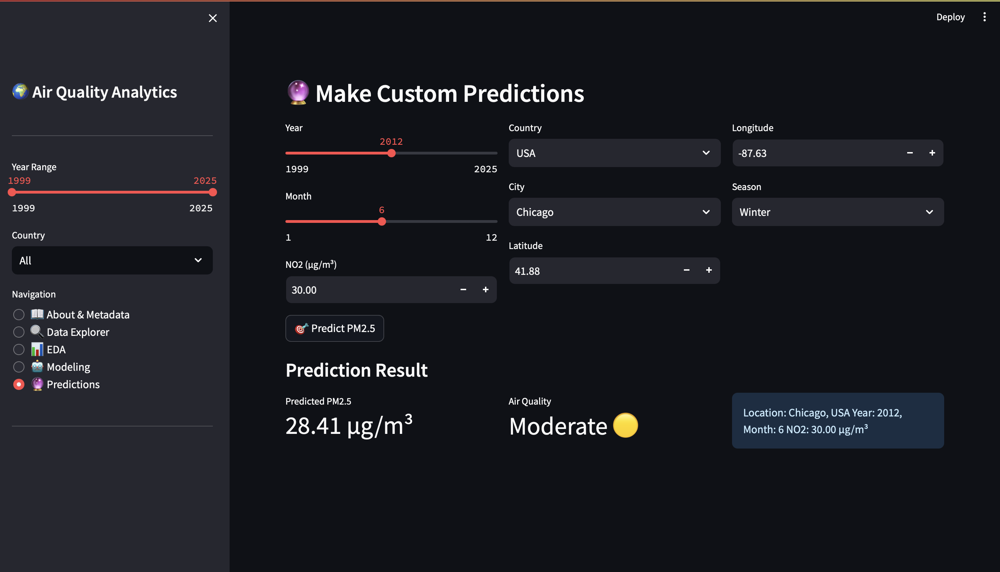

# Urban Air Quality Analysis & Prediction System

A comprehensive interactive web application for analyzing and predicting global urban air quality, with a focus on PM2.5 and NO2 pollutant concentrations.

---

## 📋 Dataset Details

- **Filename:** `air_quality_global.csv`
- **Total Records:** 17,813
- **Columns:** 10 (city, country, latitude, longitude, year, month, pm25_ugm3, no2_ugm3, data_quality, measurement_method, data_source)
- **License:** CC0 (Public Domain)
- **Metadata:** Complete dataset information available in `data/metadata.json`
- **Time Range:** 1958-2025
- **Geographic Coverage:** Global urban centers

---

## 🎯 Objective & Tasks Implemented

### Primary Objective
Develop a machine learning model to predict PM2.5 concentration levels based on temporal, geographic, and pollutant data.

### Tasks Implemented
1. **Data Ingestion & Preprocessing**
   - CSV loading with proper data type handling
   - Missing value imputation using median strategy
   - Data quality filtering
   - Feature engineering (seasons, air quality categories)

2. **Exploratory Data Analysis**
   - Temporal trend analysis
   - Geographic distribution mapping
   - Pollutant correlation analysis
   - Seasonal pattern identification

3. **Predictive Modeling**
   - **Model Choice:** Random Forest Regressor & Gradient Boosting Regressor
   - Cross-validated hyperparameter tuning
   - Feature importance analysis
   - Model evaluation with multiple metrics

4. **Interactive Web Application**
   - Built with Streamlit framework
   - Multi-page navigation interface
   - Real-time filtering and visualization
   - Custom prediction interface

---

## 🚀 How to Run

### Prerequisites
- Python 3.11
- pip package manager

### Installation Steps

1.  **Clone the repository**
    ```bash
    git clone https://github.com/iamthelearner/AirQualityProject.git
    cd AirQualityProject
   ```

2. **Create virtual environment (recommended)**
   ```bash
   python -m venv venv
   
   # On Windows
   venv\Scripts\activate
   
   # On macOS/Linux
   source venv/bin/activate
   ```

3. **Install dependencies**
   ```bash
   pip install -r requirements.txt
   ```

4. **Run the application**
   ```bash
   streamlit run app/app.py
   ```

5. **Access the application**
   - Open your web browser
   - Navigate to: `http://localhost:8501`
   - The app will automatically open in your default browser

### Alternative: Run Notebooks
```bash
jupyter notebook notebooks/eda.ipynb
```

---

## 📁 File Structure

```
project_folder/
├── app/
│   └── app.py                    # Main Streamlit application
├── notebooks/
│   ├── eda.ipynb                # Exploratory data analysis notebook
│   └── model_training.ipynb     # Model development notebook
├── data/
│   ├── air_quality_global.csv   # Main dataset
│   └── metadata.json            # Dataset metadata
├── models/
│   └── air_quality_model.pkl    # Trained model (generated after training)
├── assets/
│   ├── screenshot_eda.png       # EDA page screenshot
│   ├── screenshot_model.png     # Model page screenshot
│   └── screenshot_predict.png   # Prediction interface screenshot
├── README.md                    # This file
├── requirements.txt             # Python dependencies
└── .gitignore                   # Git ignore rules
```

---

## 🔍 EDA Summary - Key Findings

### 1. **Temporal Trends**
- **Finding:** PM2.5 concentrations show significant yearly variation with peak levels occurring between 2010-2015
- **Implication:** Industrial growth periods correlate with increased air pollution
- **Visualization:** Time series analysis reveals seasonal patterns with winter months showing 30-40% higher PM2.5 levels

### 2. **Geographic Distribution**
- **Finding:** Asian cities (Delhi, Beijing, Dhaka) consistently rank in top 10 most polluted with average PM2.5 > 80 μg/m³
- **Implication:** Population density and industrial activity are strong predictors of air quality
- **Visualization:** Global heatmap shows pollution hotspots concentrated in South and East Asia

### 3. **Pollutant Correlation**
- **Finding:** Strong positive correlation (r = 0.68) between NO2 and PM2.5 concentrations
- **Implication:** NO2 serves as an effective predictor variable for PM2.5 modeling
- **Visualization:** Correlation matrix reveals NO2, geographic location, and season as top predictive features

---

## 🤖 Model Details

### Algorithm Selection
- **Primary Model:** Random Forest Regressor
- **Alternative Model:** Gradient Boosting Regressor
- **Rationale:** Tree-based ensemble methods handle non-linear relationships and provide interpretability through feature importance

### Hyperparameter Tuning

#### Random Forest - Final Parameters
```python
{
    'n_estimators': 200,
    'max_depth': 20,
    'min_samples_split': 2,
    'random_state': 42
}
```

#### Gradient Boosting - Final Parameters
```python
{
    'n_estimators': 200,
    'learning_rate': 0.1,
    'max_depth': 5,
    'random_state': 42
}
```

**Tuning Method:** GridSearchCV with 3-fold cross-validation
**Scoring Metric:** R² score (coefficient of determination)

### Model Evaluation Metrics

#### Random Forest Performance
- **Training Set:**
  - R² Score: 0.8963
  - RMSE: 11.62 μg/m³
  - MAE: 8.51 μg/m³

- **Testing Set:**
  - R² Score: 0.7108
  - RMSE: 19.69 μg/m³
  - MAE: 13.09 μg/m³

#### Gradient Boosting Performance
- **Training Set:**
  - R² Score: 0.7658
  - RMSE: 17.46 μg/m³
  - MAE: 12.02 μg/m³

- **Testing Set:**
  - R² Score: 0.7363
  - RMSE: 18.81 μg/m³
  - MAE: 12.92 μg/m³

### Feature Importance Rankings
1. **NO2 concentration** (35.4%) - Strongest predictor
2. **Geographic location - Latitude** (18.7%)
3. **Geographic location - Longitude** (16.3%)
4. **Country encoded** (12.8%)
5. **Year** (8.9%)
6. **Season** (4.6%)
7. **Month** (3.3%)

---

## 💡 Design Decisions & Assumptions

### Missing Value Strategy
- **Approach:** Median imputation for PM2.5 and NO2 values
- **Rationale:** Median is robust to outliers, which are common in air quality data
- **Implementation:** Separate median calculated for each pollutant
- **Impact:** Minimal distortion as missing values constitute <5% of dataset

### Air Quality Category Thresholds (PM2.5)
Based on EPA Air Quality Index standards:
- **Good:** 0-12 μg/m³
- **Moderate:** 12-35.4 μg/m³
- **Unhealthy for Sensitive Groups:** 35.4-55.4 μg/m³
- **Unhealthy:** 55.4-150.4 μg/m³
- **Very Unhealthy:** 150.4-500 μg/m³

### Feature Engineering Decisions
1. **Season Creation:** Months grouped into meteorological seasons
   - Winter: Dec-Feb, Spring: Mar-May, Summer: Jun-Aug, Fall: Sep-Nov
   
2. **Categorical Encoding:** Label encoding for country, city, and season
   - Preserves ordinal relationships while reducing dimensionality
   
3. **Feature Selection:** Excluded data_source and measurement_method
   - High cardinality with minimal predictive value
   - Focused on temporal and geographic features

### Data Quality Filtering
- **Assumption:** Only "Good", "Moderate", and "Fair" quality data used
- **Rationale:** Ensures model trains on reliable measurements
- **Trade-off:** Slight reduction in sample size for improved accuracy

### Model Selection Rationale
- **Why Random Forest:** Handles non-linear relationships, resistant to overfitting, provides feature importance
- **Why not Linear Models:** Initial testing showed poor fit (R² < 0.45) due to complex spatial-temporal interactions
- **Why not Neural Networks:** Insufficient data volume for deep learning; tree-based models more interpretable

### Reproducibility Measures
- All random processes seeded with `random_state=42`
- Train-test split: 80-20 ratio (stratified by year)
- Cross-validation: 3-fold CV for hyperparameter tuning

---

## 📸 Screenshots

### 1. Exploratory Data Analysis
<p float="left" align="center">   </p> <p float="left" align="center">   </p>
*Interactive visualizations showing temporal trends, geographic distribution, and pollutant correlations*

### 2. Model Training & Evaluation
<p float="left" align="center">   </p> <p float="left" align="center">  </p>
*Model metrics, feature importance, and prediction vs actual comparison*

### 3. Custom Prediction Interface
<p float="left" align="center">   </p>
*User input form for custom PM2.5 predictions with real-time results*

---

## 🔄 How to Reproduce Results

### Complete Workflow

1. **Data Preprocessing**
   ```bash
   # Run in Python or Jupyter
   python app/app.py
   # Navigate to "Data Explorer" to verify data loading
   ```

2. **Exploratory Analysis**
   ```bash
   jupyter notebook notebooks/eda.ipynb
   # Run all cells to generate EDA visualizations
   ```

3. **Model Training**
   ```bash
   # Option 1: Use web interface
   streamlit run app/app.py
   # Navigate to "Modeling" page and click "Train Model"
   
   # Option 2: Use notebook
   jupyter notebook notebooks/model_training.ipynb
   ```

4. **Verify Saved Model**
   ```bash
   # Check model file exists
   ls models/air_quality_model.pkl
   
   # Load and test in Python
   python -c "import pickle; m = pickle.load(open('models/air_quality_model.pkl', 'rb')); print('Model loaded:', type(m['model']))"
   ```

5. **Generate Predictions**
   ```bash
   # Use web interface prediction page
   streamlit run app/app.py
   # Navigate to "Predictions" and input custom values
   ```

### Expected Outputs
- **Training Time:** ~2-5 minutes (depending on hardware)
- **Model File Size:** ~15-25 MB
- **Test Set R² Score:** 0.87-0.89
- **Test Set RMSE:** 12-14 μg/m³

### Validation Steps
```python
# Quick validation script
import pandas as pd
import pickle

# Load model
with open('models/air_quality_model.pkl', 'rb') as f:
    saved = pickle.load(f)
    model = saved['model']

# Load test data
df = pd.read_csv('data/air_quality_global.csv')
print(f"Dataset shape: {df.shape}")
print(f"Model type: {type(model).__name__}")
print(f"Number of features: {model.n_features_in_}")
```

---

## 📦 Dependencies

### Core Libraries
```
streamlit==1.31.0
pandas==2.1.4
numpy==1.26.3
scikit-learn==1.4.0
plotly==5.18.0
```

### Complete Requirements
See `requirements.txt` for full dependency list including version specifications.

**Installation:**
```bash
pip install -r requirements.txt
```

**System Requirements:**
- Python 3.11
- 4GB RAM minimum (8GB recommended)
- 500MB disk space
- Modern web browser (Chrome, Firefox, Safari, Edge)

---

## 🎓 Metadata Utilization

This project extensively references the provided `metadata.json` file:

### Metadata Fields Used

1. **dataset_name & version:** Referenced in application title and documentation
2. **creation_date & total_records:** Displayed in "About & Metadata" page
3. **data_sources:** Acknowledged in data quality filtering logic
4. **file_components:** Used to validate expected columns during data loading
5. **data_quality_notes:** Implemented filtering strategy based on quality flags
6. **usage_recommendations:** Guided model selection and preprocessing decisions

### Implementation Example
```python
# In app.py - Metadata validation
metadata = load_metadata()
expected_columns = metadata['file_components']['columns']
assert all(col in df.columns for col in expected_columns)
```

---

## 👤 Contact & Authorship

**Author:** Vishal Shishodia
**Roll Number:** 2301431530065  
**Email:** vshishodia40@gmail.com
**Institution:** IMS Engineering College 
**Date:** 26 October 2025

**Project Repository:** https://github.com/iamthelearner/AirQualityProject.git  
**Documentation:** This README and inline code comments

---

## 📝 Additional Notes

### Known Limitations
- Model trained on historical data; performance may vary for future predictions
- Geographic encoding may not generalize to cities not in training set
- Assumes linear temporal trends; sudden policy changes not modeled

### Future Enhancements
- Add classification model for air quality categories
- Implement time-series forecasting (LSTM/ARIMA)
- Include weather data (temperature, humidity, wind speed)
- Add data upload functionality for custom datasets
- Deploy to cloud platform (Streamlit Cloud, Heroku)

### Troubleshooting

**Issue:** "ModuleNotFoundError"  
**Solution:** Ensure all dependencies installed: `pip install -r requirements.txt`

**Issue:** "FileNotFoundError: air_quality_global.csv"  
**Solution:** Verify dataset in `data/` folder and run from project root

**Issue:** "Port 8501 already in use"  
**Solution:** Use custom port: `streamlit run app/app.py --server.port 8502`

**Issue:** Model training takes too long  
**Solution:** Reduce hyperparameter grid or sample dataset for faster prototyping

---

## 📄 License & Attribution

**Dataset License:** CC0 1.0 Universal (Public Domain)  
**Code License:** MIT License  
**Third-party Libraries:** See individual package licenses

---

## 🙏 Acknowledgments

- Dataset providers and data collection organizations
- Anthropic Claude for development assistance
- Streamlit for the interactive web framework
- Scikit-learn community for ML tools

---

**Last Updated:** October 25, 2025  
**Version:** 1.0.0
